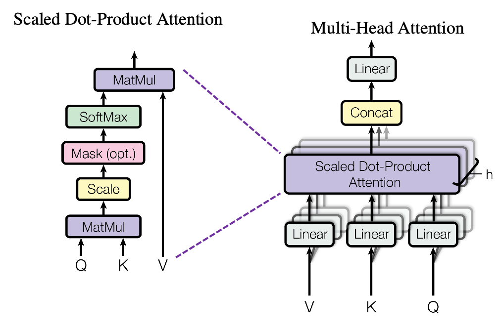

# Chapter 2: Self-Attention Mechanism

> *"Attention is all you need."*  
> — Vaswani et al., 2017

The **Self-Attention Mechanism** is the engine that powers the Transformer revolution. Unlike Recurrent Neural Networks (RNNs) that process data sequentially, self-attention allows a model to look at an entire sequence at once and determine which parts are relevant to each other. This capability to capture **long-range dependencies** is what makes modern AI models so powerful.

## The Core Mechanism

At its heart, self-attention is a database retrieval operation. For every token in a sequence, we ask: *"How relevant are other tokens to me?"*

This is achieved using three vectors derived from the input embedding $X$:
1.  **Query ($Q$)**: What I am looking for.
2.  **Key ($K$)**: What I offer to be searched.
3.  **Value ($V$)**: The actual content I contain.

Mathematically, these are computed as linear projections:
$$Q = XW_Q, \quad K = XW_K, \quad V = XW_V$$
where $W_Q, W_K, W_V$ are learnable weight matrices.

### Scaled Dot-Product Attention

The relevance score between a query and a key is calculated using a dot product. A high dot product indicates high similarity (relevance).

$$
\text{Attention}(Q, K, V) = \text{softmax} \left( \frac{QK^T}{\sqrt{d_k}} \right) V
$$

*   **$QK^T$**: Computes the similarity scores between every query and every key.
*   **$\sqrt{d_k}$**: Scaling factor to prevent gradients from vanishing in the softmax function.
*   **Softmax**: Normalizes scores into probabilities (summing to 1).
*   **$V$**: The final output is a weighted sum of values, where relevant tokens contribute more.

## Multi-Head Attention

A single attention head might focus on one type of relationship (e.g., subject-verb agreement). To capture multiple nuances, we use **Multi-Head Attention (MHA)**.

MHA runs several self-attention operations in parallel, each with its own set of weight matrices. The outputs are concatenated and projected:

$$
\text{MultiHead}(Q, K, V) = \text{Concat}(\text{head}_1, \dots, \text{head}_h) W_O
$$

This allows the model to attend to information from different representation subspaces at different positions.

## Efficient Attention & Recent Developments

While the original mechanism is powerful, it has a quadratic complexity $O(N^2)$ with respect to sequence length. Recent innovations aim to make attention more efficient and scalable.

### FlashAttention
**FlashAttention** (Dao et al., 2022) is an IO-aware exact attention algorithm that significantly speeds up training and reduces memory usage.

*   **The Problem**: Standard attention implementation requires writing large intermediate matrices (like the $N \times N$ attention matrix) to the GPU's high-bandwidth memory (HBM), which is slow.
*   **The Solution**: FlashAttention uses **tiling** to compute attention in blocks. It loads small blocks of $Q, K, V$ from HBM to the fast on-chip SRAM, computes attention, and writes only the final result back to HBM.
*   **Recomputation**: Instead of storing the large attention matrix for backward pass, it recomputes it on-the-fly, which is faster than reading it from HBM.
*   **Impact**: This results in up to **3x faster training** and allows for much longer context windows (e.g., 32k tokens) without running out of memory.

### KV Cache (Key-Value Cache)
In autoregressive generation (like GPT), the model generates one token at a time. For each new token, it needs to attend to all previous tokens.

*   **Inefficiency**: Naively, we would recompute the Key and Value vectors for the entire history at every step. This is redundant and computationally expensive ($O(N^2)$ total for generating $N$ tokens).
*   **Optimization**: We cache the Key and Value vectors of previous tokens in GPU memory. At each step, we only compute $Q, K, V$ for the *new* token and append the new $K$ and $V$ to the cache.
*   **Result**: This reduces the complexity of generating a token to $O(N)$ (linear with context length) and significantly speeds up inference.

### PagedAttention (vLLM)
As context lengths grew, managing the KV Cache became a bottleneck. The cache can be huge (gigabytes per request) and fragmented in memory.

*   **The Problem**: Traditional memory allocation reserves contiguous blocks for the KV cache. Since we don't know the final output length, we often over-allocate (wasting memory) or face fragmentation.
*   **The Solution**: Inspired by virtual memory in operating systems, **PagedAttention** (used in vLLM) breaks the KV cache into non-contiguous blocks ("pages").
*   **Mechanism**: A block table maps logical tokens to physical memory blocks. This allows the system to allocate memory dynamically on demand.
*   **Impact**: This leads to near-zero memory waste and allows serving many more concurrent requests (higher throughput) with the same hardware.

### Linear Attention
Various approaches (e.g., Linformer, Performer) approximate the softmax attention map to achieve linear complexity $O(N)$, making it feasible to process extremely long documents or genomic sequences.

### Sliding Window Attention
Used in models like **Mistral** and **Longformer**, this restricts attention to a local window around each token. This reduces computation while still allowing global information to propagate through multiple layers.
