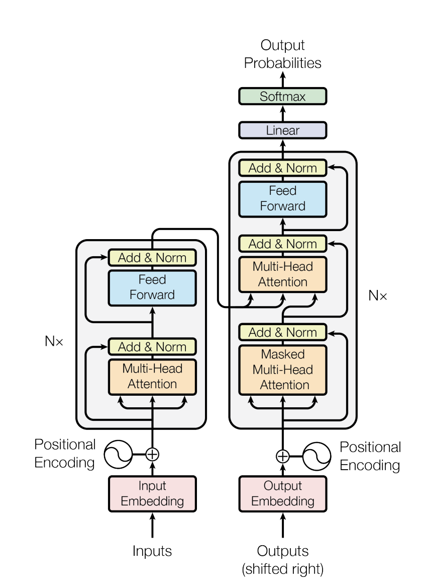

# Chapter 3: Transformers

The **Transformer** architecture, introduced in the landmark paper *"Attention Is All You Need"*, discarded recurrence and convolution entirely in favor of attention mechanisms. It has since become the foundation for virtually all state-of-the-art models in NLP, Vision, and beyond.

## The Architecture

The original Transformer is an **Encoder-Decoder** model designed for machine translation.

### The Encoder
The encoder processes the input sequence and compresses it into a context-rich representation. It consists of a stack of identical layers, each containing:
1.  **Multi-Head Self-Attention**
2.  **Feed-Forward Network (FFN)**
3.  **Layer Normalization & Residual Connections**

### The Decoder
The decoder generates the output sequence one token at a time. In addition to the components found in the encoder, it includes a **Masked Self-Attention** layer (to prevent looking at future tokens) and Cross-Attention (to attend to the encoder's output).

## Evolution of Architectures

While the original model used both encoder and decoder, modern models often specialize:

| Type | Description | Examples | Best For |
| :--- | :--- | :--- | :--- |
| **Encoder-Only** | Bidirectional understanding of the whole input. | BERT, RoBERTa | Classification, NER, Sentiment Analysis |
| **Decoder-Only** | Unidirectional (left-to-right) generation. | GPT-4, Llama 3 | Text Generation, Chatbots, Code Completion |
| **Encoder-Decoder** | Maps input sequence to output sequence. | T5, BART | Translation, Summarization |

## Key Innovations & Updates

The standard Transformer has evolved significantly since 2017.

### Mixture of Experts (MoE)
As models grew larger, training costs skyrocketed. **Mixture of Experts (MoE)** (e.g., **Mixtral 8x7B**, **Switch Transformer**) addresses this by activating only a subset of parameters for each token.

*   **Sparse Activation**: Instead of using one dense FFN, the model has multiple "expert" networks (e.g., 8 experts). For every token, a **router network** (or gating network) selects the top-k experts (usually k=1 or 2) to process that specific token.
*   **Routing Mechanism**: The router computes a probability distribution over experts. The token is sent to the experts with the highest probabilities.
    $$ G(x) = \text{Softmax}(x \cdot W_g) $$
*   **Load Balancing**: A critical challenge is ensuring all experts are used equally. If one expert is popular, it becomes a bottleneck. Auxiliary loss functions are used to encourage balanced routing.
*   **Efficiency**: This allows models to have massive parameter counts (trillions) while keeping inference costs low (comparable to much smaller dense models).

### Grouped-Query Attention (GQA) & Multi-Query Attention (MQA)
Standard Multi-Head Attention (MHA) has a separate Key and Value head for every Query head. This results in a large KV cache size, slowing down inference.

*   **Multi-Query Attention (MQA)**: Uses **one** Key and Value head shared across **all** Query heads. This drastically reduces memory usage but can degrade performance.
*   **Grouped-Query Attention (GQA)**: A middle ground used in **Llama 2** and **Llama 3**. It groups Query heads (e.g., 8 groups) and assigns one Key/Value head to each group. This offers a better trade-off between performance and efficiency.

### Rotary Positional Embeddings (RoPE)
The original Transformer used absolute sinusoidal positional encodings. **RoPE** (Su et al., 2021) encodes relative position by rotating the query and key vectors in the embedding space. This allows models to generalize better to sequence lengths longer than those seen during training.

### ALiBi (Attention with Linear Biases)
ALiBi eliminates positional embeddings entirely by adding a static bias to the attention scores based on the distance between tokens. This simple change allows for extrapolation to much longer sequences.

### RMSNorm & SwiGLU
Modern LLMs (like Llama) often replace LayerNorm with **RMSNorm** (Root Mean Square Normalization) for stability and use **SwiGLU** activation functions in the FFN for better performance.
