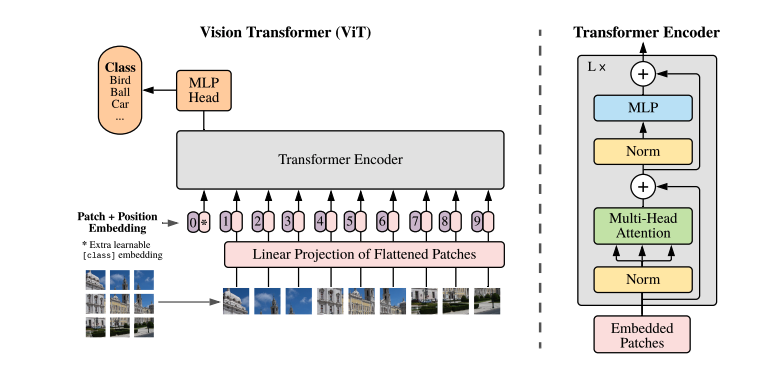
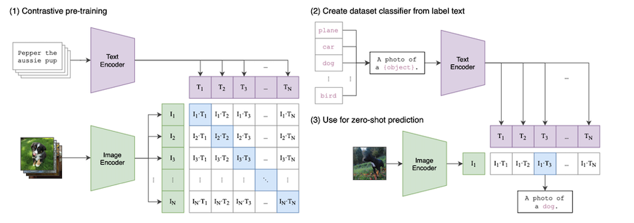
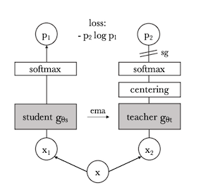

# Chapter 4: Image Encoders

Image encoders have evolved significantly with the emergence of
**self-supervised learning** techniques. Building on the **Transformer** architecture discussed in the previous chapter, we now explore how these mechanisms are applied to vision. Recent advancements like **DINO** and **DINOv2** have demonstrated strong performance in learning feature representations without labeled data.


# Vision Transformers (ViTs)

ViTs apply \*\*self-attention\*\* to image data, treating images as
sequences of patches rather than using convolutional operations.




## Patch Extraction and Encoding

An image is split into patches, flattened, and passed through a
\*\*linear projection\*\*: $$X_{patch} = W_E \cdot X_{input} + b_E$$
where $W_E$ is the embedding matrix and $b_E$ is a bias term. These
embeddings are then processed using self-attention layers to extract
contextual information.


## Applications of Vision Transformers (ViTs)

```{r, echo=FALSE}
library(knitr)

data <- data.frame(
  Application = c(
    "Image Classification",
    "Object Detection & Segmentation",
    "Medical Image Analysis",
    "Video Understanding & Action Recognition",
    "Remote Sensing & Satellite Image Processing",
    "Image Generation & Super-Resolution",
    "Robotics & Autonomous Navigation",
    "Face Recognition & Biometrics",
    "Optical Character Recognition (OCR)",
    "Fashion & Retail"
  ),
  Description = c(
    "Categorizing images into different classes",
    "Identifying and segmenting objects in images",
    "Detecting diseases from medical scans",
    "Recognizing actions in video frames",
    "Land classification, disaster analysis",
    "Enhancing image quality and generating realistic images",
    "Scene understanding for self-driving cars & robots",
    "Identity verification and surveillance",
    "Extracting text from images and documents",
    "Virtual try-ons, fashion recommendations"
  ),
  `Example Use Cases` = c(
    "ViTs trained on ImageNet outperform ResNets",
    "DETR (Facebook AI) for autonomous driving and surveillance",
    "Cancer detection in pathology slides using ViTs",
    "TimeSformer for video classification",
    "Urban planning, flood detection",
    "DALL·E and Stable Diffusion for AI-generated art",
    "ViTs used in autonomous robot perception modules",
    "ViT-based facial recognition in low-light conditions",
    "Google's OCR for document scanning and language translation",
    "Automated product tagging in e-commerce"
  )
)

kable(data, caption = "Applications of Vision Transformers (ViTs)")
```


# Contrastive Language-Image Pretraining (CLIP)

CLIP is a multimodal self-supervised learning model designed to learn
joint representations of images and text. It is trained on a large
dataset of image-text pairs using a contrastive learning approach.

## Architecture

CLIP consists of two main components:

-   An image encoder (ResNet or Vision Transformer)

-   A text encoder (Transformer-based model)

Both encoders project images and text into a shared embedding space,
where semantically similar images and text have higher similarity
scores.




## Training Objective

CLIP uses a contrastive learning objective where it maximizes the cosine
similarity between matching image-text pairs while minimizing similarity
between mismatched pairs:
$$\mathcal{L}_{CLIP} = - \sum_{i} \log \frac{e^{\cos(I_i, T_i)/\tau}}{\sum_j e^{\cos(I_i, T_j)/\tau}}$$
where $I_i$ and $T_i$ are corresponding image-text pairs, and $\tau$ is
a temperature parameter that controls the sharpness of the distribution.

## Applications of CLIP

-   Zero-shot image classification

-   Image retrieval and search

-   Generating text-based descriptions of images

-   Few-shot learning for downstream vision tasks

CLIPs ability to understand images and text jointly makes it a powerful
model for many vision-language applications.

# DINO: Self-Supervised Vision Encoding

DINO (Self-Distillation without Labels) is a \*\*self-supervised
learning method\*\* that trains a \*\*student\*\* network to predict the
output of a momentum \*\*teacher\*\* network.




## Key Features of DINO

-   Works with both CNNs and ViTs

-   Learns representations using \*\*contrastive learning\*\*

-   Uses a momentum teacher-student setup

-   Multi-crop augmentation for efficient feature learning

-   Achieves competitive performance in unsupervised representation
    learning

## DINO Training Process


The DINO training process uses a self-supervised learning (SSL) approach that can be interpreted as a form of knowledge distillation without labels. It involves a student network and a teacher network that have the same architecture but different parameters. The key steps in the DINO training process are as follows:

•Input and Augmentation: An input image is passed through two different random transformations, creating two distorted views. These views are fed into the student and teacher networks.

•Student and Teacher Networks: The student network (gθs) and the teacher network (gθt) process the augmented images, outputting feature maps. The teacher network's output is centered by subtracting the mean over the batch. Both the student's and teacher's outputs are normalized using a softmax function with a temperature parameter that controls the output distribution.

•Loss Calculation: A cross-entropy loss is calculated by measuring the similarity between the probability distributions from the student network and the teacher network. The student network is trained to match the output of the teacher network using this loss function.DINO minimizes the cross-entropy loss between teacher and student
outputs: $$\mathcal{L}_{DINO} = - \sum_{i} p_i^T \log p_i^S$$ where
$p_i^T$ and $p_i^S$ are teacher and student predictions. 

•Teacher Update: The teacher network's parameters are updated using an exponential moving average (EMA) of the student network's parameters. Gradient back-propagation is limited to the student network. The teacher network is updated by the formula: c ← mc+ (1−m) 1/B * ∑(from i=1 to B) gθt(xi), where 'm' is a rate parameter and 'B' is the batch size.

•Centering and Sharpening: The teacher network's output is centered with a mean computed over the batch, and output sharpening is achieved by using a low temperature value in the teacher's softmax normalisation.

•Multi-Crop Training: The student is fed multiple crops of an image, and it must align its local feature representations with those predicted by the teacher network for the global views of the image. This helps the network learn distinctive local features required for tasks like semantic segmentation.


•Momentum Encoder: The momentum teacher constantly outperforms the student during training. This is achieved by updating the teacher parameters using an exponential moving average of the student's parameters. The momentum encoder helps to stabilise training and improves performance.

•Multi-crop Augmentation: Training with multiple crops of an image improves performance. DINO benefits significantly from multi-crop training.

•Cross-Entropy Loss: Using a cross-entropy loss on the sharpened softmax outputs is an important component for good features.

•Centering: Centering the teacher output is important in avoiding collapse, particularly when a predictor or batch normalisation is not used.

The DINO framework is flexible and works on both convolutional neural networks (convnets) and Vision Transformers (ViTs) without modifying the architecture or internal normalisations


# DINOv2: Improved Vision Encoding

DINOv2 extends DINO with \*\*Masked Image Modeling (MIM)\*\* and
\*\*Self-Supervised Instance Discrimination\*\*, improving its ability
to capture both local and global features.

## Key Improvements in DINOv2

-   Introduces \*\*masked image modeling (MIM)\*\* to learn local
    textures

-   Uses \*\*multi-crop augmentation\*\* to enhance representation
    learning

-   No reliance on \*\*text supervision\*\* (unlike CLIP)

-   Improved transferability to \*\*dense prediction tasks\*\* (e.g.,
    segmentation)

-   Asymmetric teacher-student design for more effective training

-   Incorporates KoLeo regularization to improve feature uniformity

## Masked Image Modeling (MIM)

MIM extends the concept of MLM to images by randomly masking patches in
an image and training the model to reconstruct the missing information.
The objective function for MIM is:
$$\mathcal{L}_{MIM} = - \sum_{i \in M} \log P(I_i | I_{\backslash i})$$
where $I_i$ represents the masked image patch, and $I_{\backslash i}$
denotes the observed patches.

## Training Objectives

DINOv2 uses a \*\*hybrid objective\*\*:
$$\mathcal{L}_{DINOv2} = \lambda_1 \mathcal{L}_{MIM} + \lambda_2 \mathcal{L}_{Instance}$$
where:

-   $\mathcal{L}_{MIM}$ is the loss for \*\*masked image modeling\*\*,
    focusing on reconstructing masked patches

-   $\mathcal{L}_{Instance}$ is the loss for \*\*instance
    discrimination\*\*, ensuring robust feature alignment across
    augmentations

DINOv2 leverages a \*\*vision-only training approach\*\*, making it
highly effective for self-supervised learning in image-based tasks.

##  Applications of DINO

DINO and DINOv2 represent significant advances in \*\*self-supervised
learning for vision tasks\*\*. Their ability to learn rich
representations \*\*without labeled data\*\* makes them valuable for
diverse applications such as \*\*image classification, retrieval,
segmentation, and biomedical imaging\*\*.


Some applications of DINO include:

•Image Classification: DINO can be used for image classification tasks, achieving high accuracy on benchmarks such as ImageNet. It has been shown to outperform other self-supervised methods when used with ViTs. For example, DINO achieves 80.1% top-1 accuracy on ImageNet in linear evaluation with ViT-Base, which is superior to previous self-supervised features.

•Feature Extraction: DINO can extract robust visual features that are useful for various downstream tasks. These features capture semantic information about the image, and are effective when used in combination with k-NN classifiers. DINO features have demonstrated excellent k-NN classification performance. For example, a ViT-S/8 trained with DINO reached 78.3% top-1 accuracy on ImageNet with a k-NN classifier.

•Object Discovery and Segmentation: Self-supervised ViT features from DINO contain explicit information about the semantic segmentation of an image. This is a unique property that is not as apparent with supervised ViTs or with convnets. DINO trained ViTs are able to separate objects.

•Image Retrieval: DINO features can be used for image retrieval tasks. DINO outperforms supervised learning methods in image retrieval tasks. When trained on the Google Landmarks v2 (GLDv2) dataset, DINO ViT features perform exceptionally well for landmark retrieval.

•Copy Detection: DINO can be applied to copy detection tasks where the goal is to identify images that have been distorted. ViTs trained with DINO are very competitive in this application.

•Transfer Learning: Features pre-trained with DINO transfer effectively to various downstream tasks, outperforming supervised pre-training in many cases. Fine-tuning DINO pre-trained models on downstream tasks leads to improved results compared to models trained with supervision. Self-supervised pre-training with DINO significantly improves results on ImageNet, achieving 1-2% improvement over supervised pre-training.

•Low-shot learning: DINO can be used for low-shot learning, where models are trained with very little labelled data. DINO has shown strong performance in low-shot learning scenarios.

•Medical Imaging: The DINO framework can be adapted for medical imaging applications. RAD-DINO, a model pre-trained using the DINOv2 framework, demonstrates that high-quality biomedical image encoders can be trained using only unimodal imaging data, without relying on text supervision. This is especially useful where there is a scarcity of paired image-text data. RAD-DINO performs comparably or better than state-of-the-art language-supervised models on image classification, semantic segmentation, and text report generation from images.

◦Image classification RAD-DINO achieves similar or superior performance levels on image classification tasks compared to language-supervised models.

◦Semantic segmentation RAD-DINO performs well on semantic segmentation tasks without needing large, densely annotated training datasets.

◦Report generation RAD-DINO excels at generating accurate text reports from images, outperforming models trained with language supervision.

◦Prediction of demographic information RAD-DINO can more accurately predict patient demographic information (e.g., sex or age) compared to language-supervised models.


# GENERATIVE MODELS 


