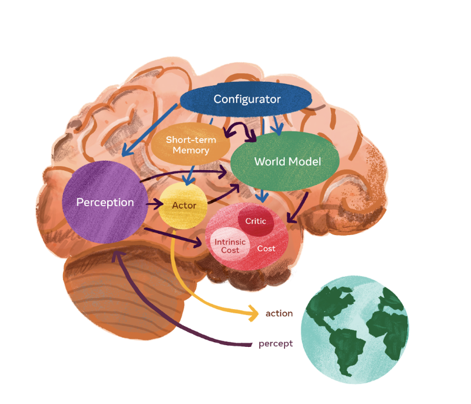

--- 
title: "Foundations of World Models"
author: "Jehill Parikh"
date: "`r Sys.Date()`"
site: bookdown::bookdown_site
output: bookdown::gitbook
documentclass: book
bibliography: [book.bib, packages.bib]
biblio-style: apalike
link-citations: yes
github-repo: rstudio/bookdown-demo
description: "This is a minimal example of using the bookdown package to write a book. The output format for this example is bookdown::gitbook."
---

# Introduction

> *"The brain is a prediction machine. It is constantly generating predictions about the world and updating them based on sensory input."*  
> — Jeff Hawkins

## The Next Frontier in AI

Artificial Intelligence has achieved superhuman performance in specific domains—from mastering Go to generating photorealistic images. Yet, most of these systems are fundamentally **reactive**. They map inputs to outputs without a true understanding of the underlying mechanisms that govern their environment.

**World Models** represent a paradigm shift.

Inspired by human cognition, a World Model equips an AI agent with an **internal simulation of its environment**. This allows the agent to:
1.  **Understand** the current state of the world beyond immediate sensory data.
2.  **Predict** future states and the consequences of its actions.
3.  **Plan** in a latent mental space before acting in the real world.

This capability—**imagination**—is what separates biological intelligence from traditional pattern recognition. By learning a compact, predictive model of the world, AI systems can learn faster, generalize better, and act more autonomously.

## Foundations of World Models

This book explores the theoretical and practical pillars of World Models, sitting at the intersection of:

*   **Deep Generative Modeling**: Leveraging **VAEs**, **GANs**, and **Diffusion Models** to learn high-fidelity representations of complex environments.
*   **Reinforcement Learning**: Integrating **Model-Based RL** to enable planning and long-term reasoning.
*   **Self-Supervised Learning**: Utilizing vast amounts of unlabeled data to learn robust feature representations (e.g., **DINO**, **JEPA**).
*   **Neuroscience**: Drawing inspiration from the brain's predictive coding mechanisms.

## What You Will Learn

This book is structured to guide you from the fundamental building blocks to state-of-the-art architectures:

*   **Chapter 1: Introduction** - The philosophy and evolution of World Models.
*   **Chapter 2: Image Encoders** - How we compress high-dimensional sensory data (ViTs, CLIP, DINO).
*   **Chapter 3: Generative Models** - The engines of imagination (GANs, VAEs, Diffusion).
*   **Chapter 4: Markov Decision Processes** - The mathematical framework for decision making.
*   **Chapter 5: Reinforcement Learning** - Algorithms for learning optimal policies.
*   **Chapter 6: DINO-WM** - A case study on using self-supervised features for planning.
*   **Chapter 7: JEPA** - The Joint Embedding Predictive Architecture and the future of predictive learning.

## Who This Book Is For

This book is designed for **researchers, engineers, and students** who want to move beyond standard deep learning and explore the frontier of **embodied intelligence** and **predictive modeling**. A background in deep learning and basic reinforcement learning is recommended.

Let's begin the journey of building machines that can *imagine*.

